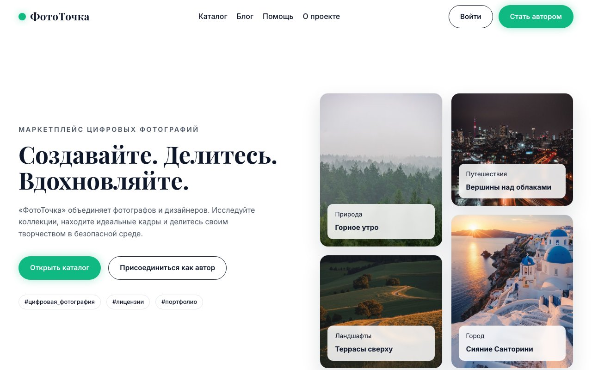
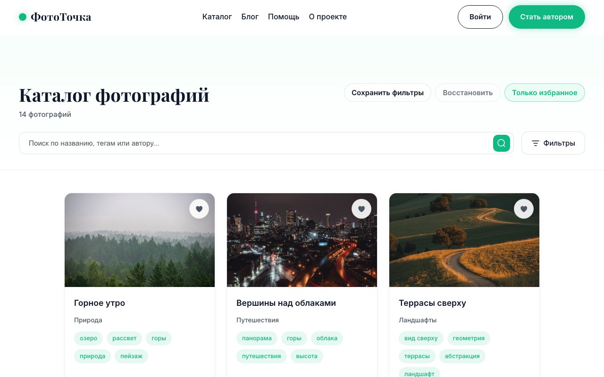
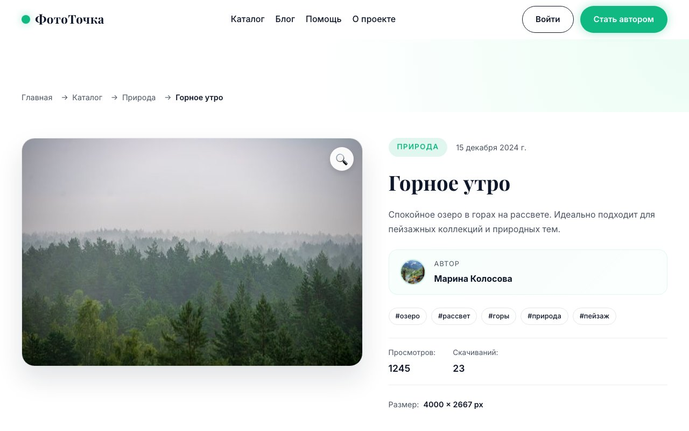
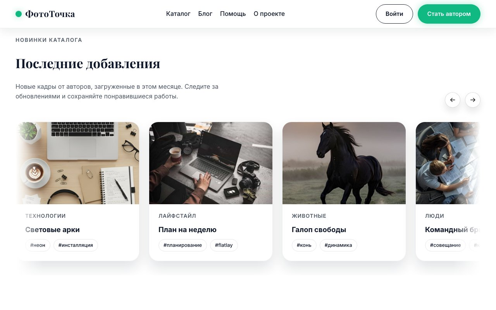
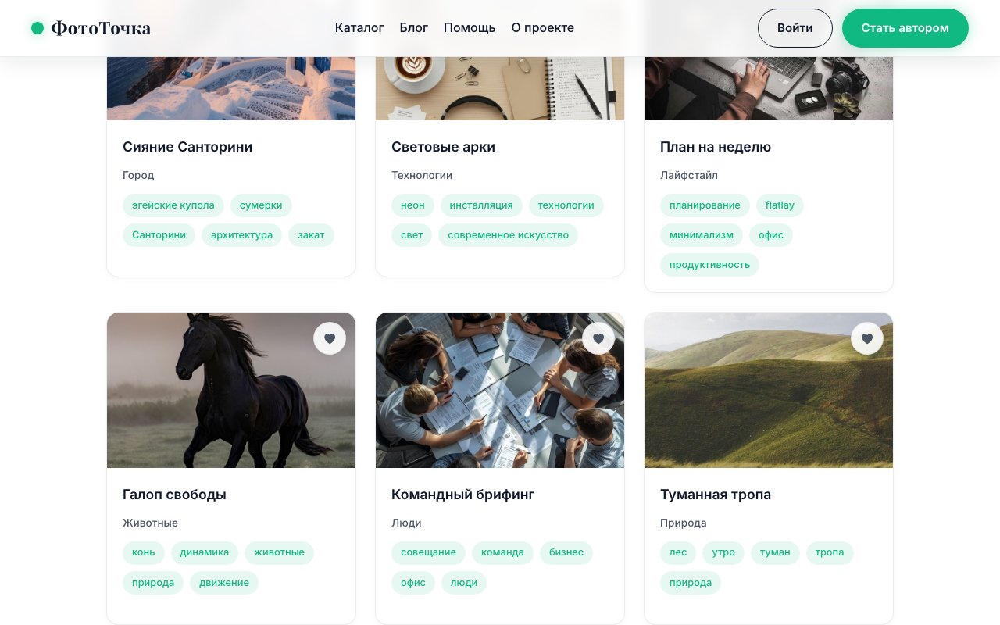
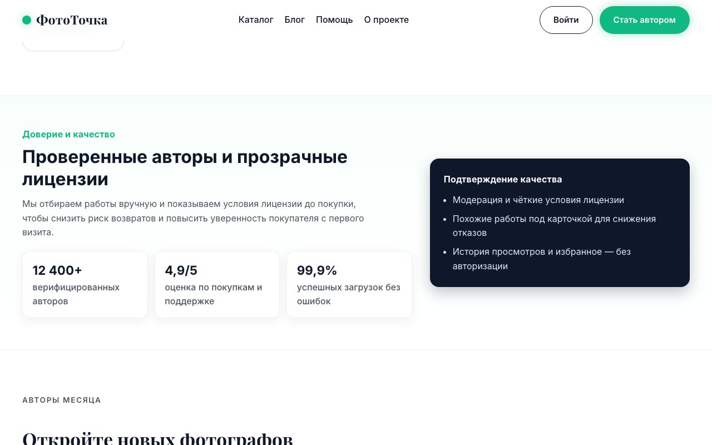
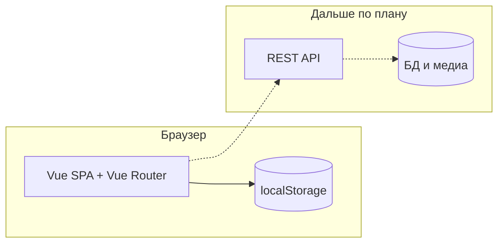

# ФотоТочка (phototochka)

**RU:** учебный **MVP** маркетплейса стоковых фотографий: витрина, каталог с фильтрами, карточка фото, личный кабинет автора и **демо**-админка на клиенте. Данные и «оплата» — макеты для UX и SEO; отдельного бэкенда в этой ветке нет.

**EN:** a diploma **portfolio** project — a Vue 3 SPA that prototypes a stock-photo marketplace (catalog, detail page, author workspace, mock admin). Content is mocked on the client; there is **no** production backend or payments in this repository.

---

## Интерфейс

| Главная | Каталог | Карточка фото |
| :---: | :---: | :---: |
|  |  |  |

| Новинки на главной | Лента каталога | Блок доверия |
| :---: | :---: | :---: |
|  |  |  |

| Похожие фото |
| :---: |
|  |

> Скриншоты можно переснять: `npm run build`, затем в одном терминале `npm run preview -- --host 127.0.0.1 --port 4173`, в другом — `npm run capture:readme` (нужен `npx playwright install chromium` один раз).

---

## Оглавление

- [Возможности](#возможности)
- [Стек](#стек)
- [Архитектура](#архитектура-упрощённо)
- [Быстрый старт](#быстрый-старт)
- [Переменные окружения](#переменные-окружения)
- [Локальные материалы](#локальные-материалы)
- [Безопасность](#безопасность)

---

## Возможности


| Область           | Что сделано в MVP                                                            |
| ----------------- | ---------------------------------------------------------------------------- |
| **Витрина**       | Главная с подборками, поиском, CTA, блоками доверия и подписки.              |
| **Каталог**       | Фильтры, избранное, сохранённые фильтры в `localStorage`, лента карточек.    |
| **Карточка фото** | Детали, теги, похожие работы, навигация между кадрами.                       |
| **Автор**         | Разделы дашборда, загрузки (UI), аналитики и настроек — на мок-данных.       |
| **Админка**       | Демо-панель (статистика, фото, авторы, категории) после демо-входа.          |
| **SEO**           | Мета-теги и canonical по маршрутам, `robots`/`noindex` для закрытых страниц. |


---

## Стек


| Слой          | Технологии                                                                 |
| ------------- | -------------------------------------------------------------------------- |
| **UI**        | Vue 3, Vue Router, TypeScript, Vite                                        |
| **Сборка**    | `vue-tsc`, `vite-plugin-singlefile` (сборка в один HTML при необходимости) |
| **Скриншоты** | Playwright (опционально, devDependency)                                    |


---

## Архитектура (упрощённо)




---

## Быстрый старт

### Требования


| Компонент | Ориентир |
| --------- | -------- |
| Node.js   | 20+      |
| npm       | 10+      |


### Установка и запуск

```bash
cp .env.example .env
# задайте VITE_DEMO_ADMIN_EMAIL / VITE_DEMO_ADMIN_PASSWORD для демо-входа
npm install
npm run dev
```

Сборка статики:

```bash
npm run build
npm run preview
```

---

## Переменные окружения

Копируйте из `[.env.example](./.env.example)`.


| Переменная                      | Назначение                                               |
| ------------------------------- | -------------------------------------------------------- |
| `VITE_SITE_URL`                 | Канонический URL без завершающего `/` (SEO, Open Graph). |
| `VITE_DEMO_ADMIN_EMAIL`         | Email для **mock**-входа с ролью администратора.         |
| `VITE_DEMO_ADMIN_PASSWORD`      | Пароль для mock-входа.                                   |
| `VITE_DEMO_ADMIN_DISPLAY_NAME`  | Необязательно: отображаемое имя после входа.             |
| `VITE_YANDEX_METRICA_ID`        | Необязательно: числовой ID счётчика Яндекс.Метрики.      |
| `VITE_YANDEX_SITE_VERIFICATION` | Необязательно: содержимое meta `yandex-verification`.    |


Без `VITE_DEMO_ADMIN_`* вход в демо-аккаунт **отключён** (чтобы форки не «нашли» пароль в коде). Без `VITE_YANDEX_METRICA_ID` счётчик **не** загружается.

---

## Локальные материалы

Каталог `docs/` и настройки `.cursor/` **не входят** в git (см. `.gitignore`): туда удобно складывать план диплома, отчёты по лабораторным и личные заметки. В репозитории остаётся только то, что нужно для сборки и демонстрации кейса.

---

## Безопасность

- Mock-авторизация в `localStorage` **не** заменяет IAM и не пригодна для продакшена.
- Не публикуйте реальные ключи и пароли; для своего деплоя задавайте переменные в CI или на хостинге, а не в истории git.
- Публичный счётчик аналитики включайте осознанно: без ID в env посторонние клоны репозитория не отправят события в ваш счётчик.

