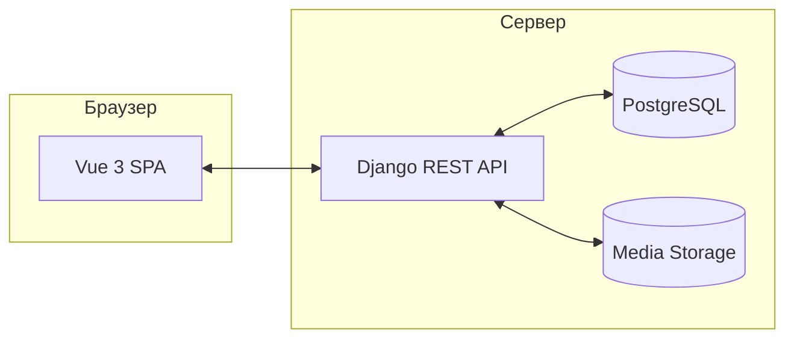

# ФотоТочка (phototochka)

**RU:** полноценный **Fullstack** дипломный проект маркетплейса стоковых фотографий: витрина, каталог с фильтрами, карточка фото, личный кабинет пользователя и панель администратора. Реализовано на **Django 5** и **Vue 3** с автоматизированным тестированием (E2E) и Docker-инфраструктурой.

**EN:** a full-featured **Fullstack** stock-photo marketplace project — built with **Django 5** and **Vue 3**. Includes catalog, user profile, admin panel, automated E2E testing (Playwright), and Docker-ready infrastructure.

---

## Интерфейс

| Главная | Каталог | Карточка фото |
| :---: | :---: | :---: |
|  |  |  |

| Новинки на главной | Лента каталога | Блок доверия |
| :---: | :---: | :---: |
|  |  |  |

| Похожие фото |
| :---: |
|  |

> Скриншоты можно переснять: `./photo build`, затем в одном терминале `./photo up`, в другом — `cd frontend && npm run capture:readme` (нужен `npx playwright install chromium`).

---

## Оглавление

- [Возможности](#возможности)
- [Стек](#стек)
- [Архитектура](#архитектура)
- [Быстрый старт](#быстрый-старт)
- [Деплой на VDS](#деплой-на-vds)
- [Переменные окружения](#переменные-окружения)
- [Локальные материалы](#локальные-материалы)
- [Безопасность](#безопасность)

---

## Возможности

| Область           | Что реализовано                                                              |
| ----------------- | ---------------------------------------------------------------------------- |
| **Витрина**       | Главная с динамическими подборками, поиском и блоками доверия.               |
| **Каталог**       | Реальные данные из БД, фильтры, избранное, пагинация.                        |
| **Карточка фото** | Детали, теги, похожие работы (через API).                                    |
| **Профиль**       | JWT-авторизация, редактирование данных, личный кабинет.                      |
| **Админка**       | Панель управления статистикой, авторами и категориями (на Vue + API).        |
| **Качество**      | Pytest (Backend), Playwright E2E и Visual Regression тесты.                  |

---

## Стек

| Слой           | Технологии                                             |
| -------------- | ------------------------------------------------------ |
| **Frontend**   | Vue 3, Vite, TypeScript, Vue Router                    |
| **Backend**    | Django 5, DRF, JWT (SimpleJWT), Whitenoise             |
| **QA / Tests** | Playwright (E2E & Visual), Pytest (API)                |
| **Infrastructure** | Docker, Postgres, Bash CLI Orchestrator            |

---

## Архитектура



---

## Быстрый старт

Для управления всеми процессами используется корневой CLI-инструмент `./photo`.

### Требования
* Node.js 20+
* Python 3.12+
* Docker Desktop

### Установка и запуск (Docker)
```bash
./photo up
```
Команда создаст `.env`, поднимет PostgreSQL и Django в контейнерах, применит миграции и дождется готовности API.

### Наполнение демо-данными
```bash
./photo seed
```
Заполнит базу реальными фотографиями из папки `frontend/src/assets/images`.

### Запуск тестов
```bash
./photo test:full
```
Прогонит полный цикл: тесты бэкенда, проверку типов фронтенда и сквозные тесты Playwright.

---

## Деплой на VDS

Проект поддерживает автоматизированный деплой на любой Linux-сервер с Docker через `rsync` и `ssh` (аналогично скриптам в `jitro`).

1. Настройте параметры сервера в `.env`:
   - `PHOTO_DEPLOY_HOST` — IP или домен сервера.
   - `PHOTO_DEPLOY_USER` — пользователь (например, `root`).
   - `PHOTO_DEPLOY_PATH` — путь к проекту на сервере.

2. Запустите деплой:
```bash
./photo deploy
```
Скрипт синхронизирует код, соберет образы на сервере, накатит миграции, заполнит сиды и перезапустит контейнеры.

---

## Переменные окружения

Копируйте из `[.env.example](./.env.example)`.

| Переменная          | Назначение                                               |
| ------------------- | -------------------------------------------------------- |
| `VITE_API_URL`      | URL API бэкенда (в dev — пусто для проксирования).       |
| `DJANGO_SECRET_KEY` | Секретный ключ Django.                                   |
| `DATABASE_URL`      | Строка подключения к БД (Postgres).                      |
| `SEED_ADMIN_EMAIL`  | Email администратора для первичного сидирования.         |
| `PHOTO_DEPLOY_HOST` | Хост для автоматизированного деплоя.                     |

---

## Локальные материалы

Каталог `docs/` и настройки `.cursor/` **не входят** в git (см. `.gitignore`). В репозитории остаются только исходный код, тесты и конфигурации для развертывания.

---

## Безопасность

- **JWT Auth**: Используется безопасная передача токенов с механизмом Refresh.
- **IsAdminUser**: Все административные эндпоинты защищены проверкой прав на стороне бэкенда.
- **Rate Limiting**: Рекомендуется настроить на уровне Nginx перед деплоем в прод.

---
© 2026 ФотоТочка. Дипломный проект.
