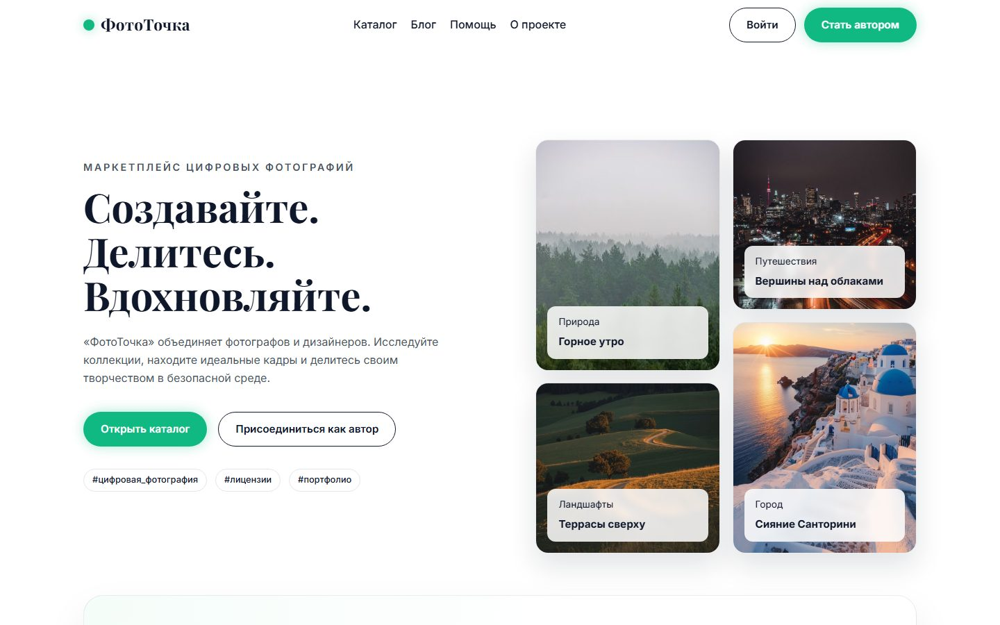
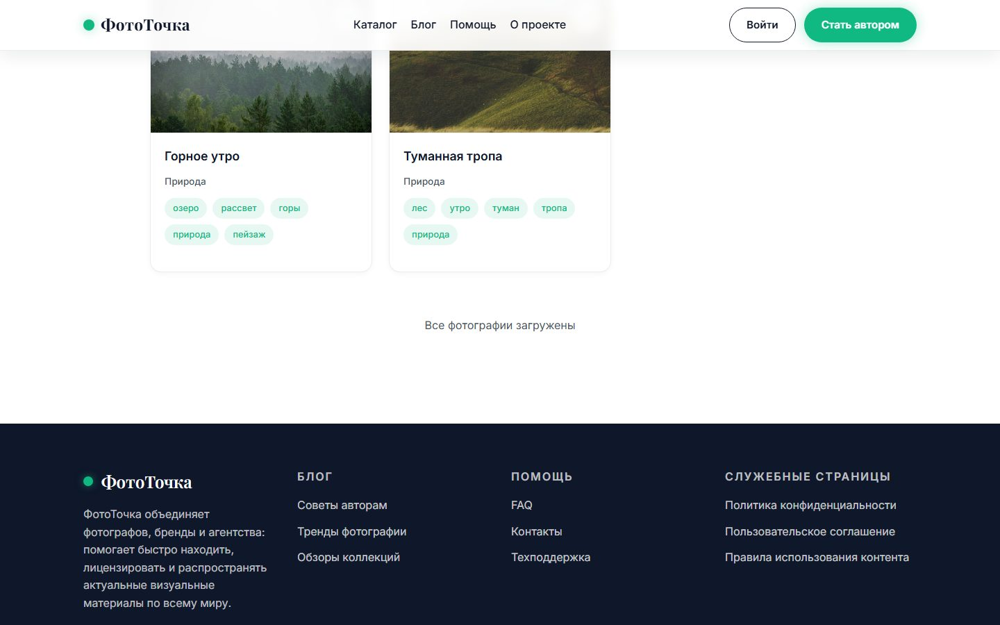
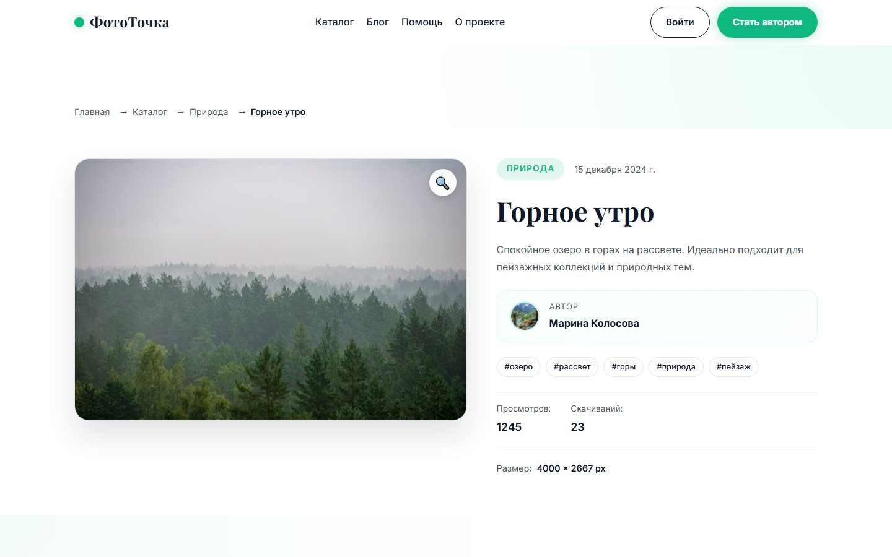

# ЛР‑5. Анализ поведенческих факторов веб‑приложения «ФотоТочка»

Краткая академическая фиксация внутренних ПФ по подпунктам 1–9 теоретической части. Основано на экспертном UX‑осмотре актуальной сборки; скриншоты получены автоматически (Playwright) и лежат в `docs/reports/screenshots/`.

## 1) О чём сайт
Первый экран сразу отвечает на запрос: слоган, поиск по фотографиям и CTA «Каталог» формируют понятный стартовый сценарий, снижая риск мгновенного ухода. Блок доверия с метриками (верифицированные авторы, оценка сервисной поддержки, стабильность загрузок) усиливает восприятие надёжности рядом с первичными CTA.

## 2) Витрина контента
Блок «Новинки» на главной и дублирующий CTA к каталогу показывают ассортимент и подталкивают к просмотру, что снижает вероятность отказа и повышает первый клик. Доверительные метрики рядом дополнительно мотивируют перейти в каталог.

## 3) Решение задачи пользователя
Каталог позволяет искать и фильтровать (категория, ориентация) без перезагрузки страницы; пользователь сразу видит релевантные карточки, что повышает вовлечённость и уменьшает отказы.

## 4) Навигация и маршрутизация
Хедер с активными ссылками, хлебные крошки на деталке и возврат к каталогу обеспечивают предсказуемые переходы и снижают риск «тупиков».

## 5) Интерактив и обратная связь
Фильтры применяются мгновенно, лента догружается при прокрутке, что удерживает внимание и продлевает время сессии. Добавлены отметка избранного на карточках и кнопка «следующее фото» на деталке; стоит дополнить индикатором «загружено N новых» для явной обратной связи.

## 6) Тематические материалы
Из хедера доступны контентные разделы (блог, помощь, «О проекте»), которые создают дополнительные точки входа и информационные поводы вернуться.

## 7) Перелинковка и поведение внутри сайта
На карточке есть теги, блок «Похожие фото», хлебные крошки и ссылка «Следующее фото по теме», что стимулирует переходы вглубь и повышает глубину просмотра. Дальше можно добавить коллекции автора и обратную ссылку «предыдущее фото» для симметрии.

## 8) Возвраты и повторные визиты
Есть подписка на обновления (email/push), гостевое избранное и сохранение/восстановление фильтров в каталоге через localStorage — это закрывает основные триггеры возвратов. Рекомендуется ещё подсветить историю просмотров и уведомление о поступлении новых фото в выбранных категориях.

## 9) Техническое состояние
SPA грузится быстро, изображения локальные; требуется дооформить 404 и открыть внешние ссылки в новой вкладке. После доработок — зафиксировать метрики (`view_home_first_scroll`, `engaged_time_ms`, `open_photo_detail`, `open_similar_photo`, `returning_user_30d`).

## Итоговые выводы
Текущий интерфейс снижает риск отказов за счёт понятного первого экрана и интерактивного каталога. Для роста глубины и возвратов необходимы доверительные блоки, явные переходы «следующее фото» и механизмы подписок/избранного с восстановлением фильтров; после внедрения — снять указанные метрики и повторить оценку.
